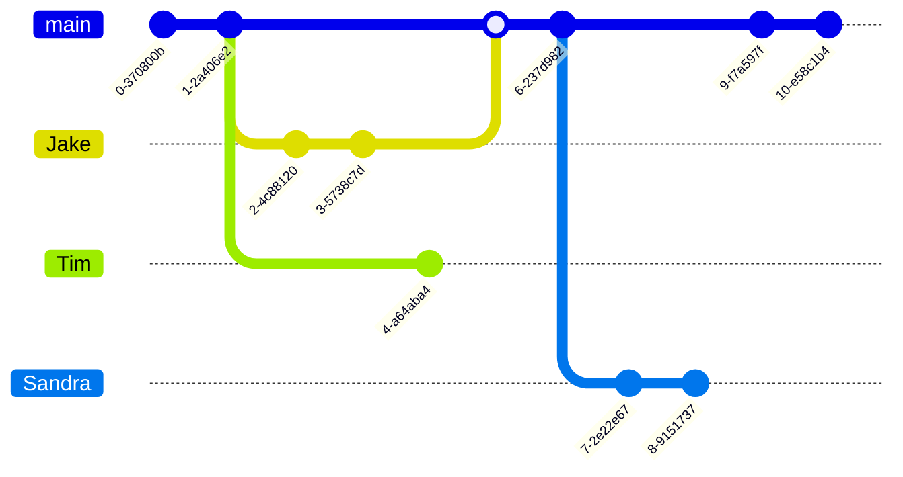

# Database Branching

With Tigris, you can branch your database schema similarly to how you branch repositories in Git.
As a result, you can have multiple isolated copies of your database schema to develop and test your features.
Additionally, you can have your CI/CD pipelines use isolated database branches for execution without any
overhead of setting up and maintaining a development database.

## Branch

Just like a Git repo, your Tigris database always defaults to the `main` branch as the primary source of data and schema.
The `main` branch is created by default in your Tigris Project's database, and you cannot delete it. All new
branches are created from `main` branch. A new branch is essentially an isolated [copy-on-write](https://en.wikipedia.org/wiki/Copy-on-write)
clone of the schema on the `main` branch at the creation time.

A database branch can evolve its schema and data independently, and you cannot delete it.
You can have any number of branches, and creating a branch does not increase the load on the `main` branch,
so you can quickly branch your database for development, staging, testing, and to segregate
data for CI/CD pipelines.

## Workflows

Let's see how you can use the database branching feature in common development workflows:

### Development

Tigris follows a code-first approach, which means you model the schema in your codebase.
First, you create a new branch for your database right from your code and seed it with data.
When you do this, you copy all the collection schemas from `main` over to the new branch.
This way, each developer in your team can have their own functional copy of code and database to work on.

This approach comes with the following benefits:

1. You can add build-time hooks to your projects to ensure that your database branch is in sync with the models in your codebase. For an example with TypeScript,
   see [automating your development workflow](../../sdkstools/typescript/database/branching.mdx#securely-automating-your-development-workflow).
2. When you merge your code, you also merge the database schema. Then, running the build step from 1. ensures the current branch receives all the required schema changes.

### Staging

Teams maintaining a separate staging or pre-production environment can have a CD pipeline
apply the schema changes to a dedicated `staging` branch.

### Testing

You can use the Tigris APIs to automate the creation and deletion of database branches. Thus, you can
ensure that each test running in parallel on the CI pipeline executes on its own copy of the data.

## Next steps

Check out the language-specific reference section to learn more about using database branching in your
favorite language:

- [Database branching in TypeScript](/docs/sdkstools/typescript/database/branching.mdx)
