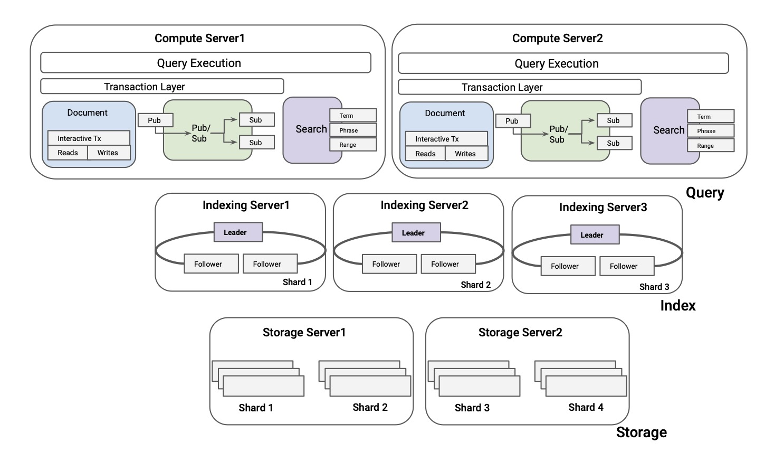
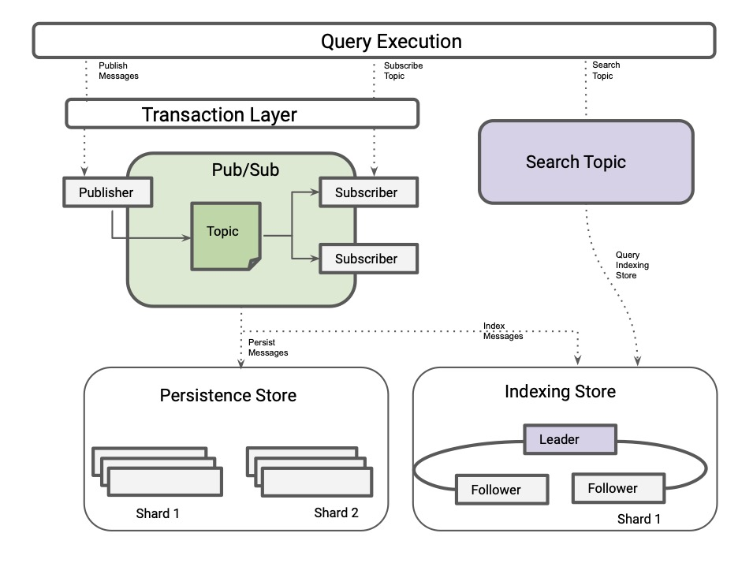

# High Level Architecture

Tigris is an open source developer data platform that replaces the need for
having separate systems to support each disparate data-model, data storage,
event streaming, global search, and infrastructure management. Tigris is
truly cloud native allowing separate components to be scaled on-demand
independently. It provides a serverless experience where developers can
focus on building new applications while storing and retrieving data with a
simple but powerful universal API.

The diagram below shows the high level architecture of Tigris.

## FoundationDB as the data persistence layer

At the heart of Tigris is FoundationDB. FoundationDB is used by Apple,
Snowflake, and countless others as a stand-alone, production-ready
distributed key-value store with interactive transactions. It provides the
same consistency guarantees as Spanner (strict serializability), and has an
amazing correctness story through
[simulation testing](https://apple.github.io/foundationdb/testing.html).
FoundationDB exposes a key-value API, similar to RocksDB, but it scales to
support petabytes of data and millions of operations per second in a single
deployment on a modest amount of commodity hardware.

Tigris uses FoundationDB’s transactional key-value interface as its
underlying storage engine. Tigris leverages FoundationDB to handle
durability, replication, sharding, transaction isolation, and load balancing.

## Cloud native architecture

Tigris was designed to separate critical components into independently
scalable pieces. Tigris separates Query, Index and the Storage layers and
allows these layers to be scaled independently based on the workload needs.

By designing Tigris using a cloud native architecture, it provides users
with incredible flexibility to run various types of workloads as well as the
ability to achieve massive scale.

### Query Processing

Applications using Tigris make use of its universal APIs to handle all
the complex data interactions. Tigris natively provides HTTP APIs and uses
JSON for transmitting data. Besides that, the Tigris API can be accessed
directly in your favorite languages. Currently, Typescript, Java and Go
libraries are available.

The user queries interact with the Tigris query layer that performs the
necessary validations (permissions, schema, quotas), generates a query plan
and then executes the query.

### Indexing

Under the hood, Tigris has implemented a fork of the popular open source
search tool Typesense and uses it to intelligently index the documents. This
means there is no need to worry about manually indexing documents or
collections and no need for detailed query tuning optimization exercises.
The indexing store can also be scaled independently of other components.

### Document Search

Tigris has search built in, and you don't need a separate platform to access
robust search capabilities, it works out of the box. Both search and query
functionality share the same indexes and are serviced by the same indexing
store under the hood.

### Streaming

Tigris has built-in event streaming support that allows you to both
subscribe to and publish topics using the same API you use to query and
search data within Tigris. You can search and access real-time events
as well as historical event replays. The ordering of events is guaranteed at
the partition level. The events are stored within FoundationDB, ensuring
data consistency and availability.

## Tigris in a Nutshell

Tigris provides a cohesive, flexible set of tools for application developers
to take an idea from production without stepping into the sinkhole of data
pipelines, broken sync jobs, and complicated concurrency bugs present in
many modern application architectures. As your data grows, so does Tigris,
with a cloud-native architecture designed for scaling. With automated
indexing, Tigris removes the need for the most common database
administration operations - index tuning and query optimization. While built-in
streaming enables data to be easily shared with new applications and
services – internal or external.
